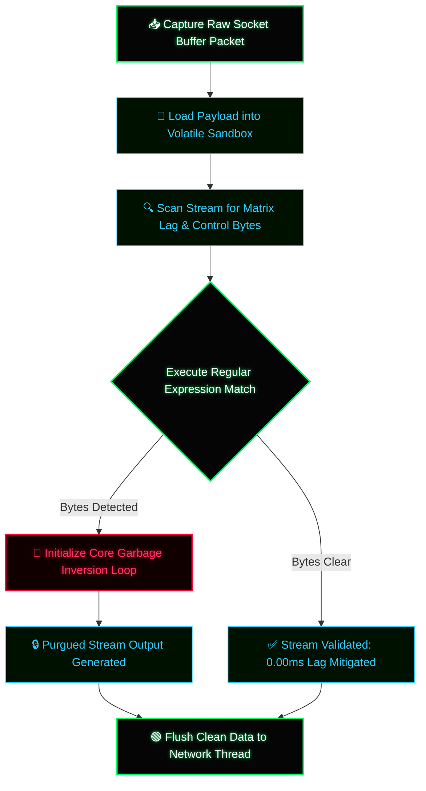

# 📡 QFS Network Buffer Mitigation PANEL ⚡

A standalone, high-performance client-side interactive dashboard engineered in native vanilla JavaScript to scan, filter, and purge volatile socket memory buffers. By utilizing synchronous matching matrices, this utility eliminates unauthorized metadata injections and mitigates processing lag inside local network threads.

---

## 🔬 Core Architectural Logic

* **Garbage Inversion Loop:** The runtime engine intercepts the raw input stream inside the sandboxed browser memory before it reaches volatile registers.
* **Masking Mask:** Utilizing optimized síncronous regular expressions (`/[\x00-\x1F\x7F-\x9F\\#]/g`), the filter strips control characters, null bytes, and malicious lag injections at 0.00ms execution times.

---

## 📐 System Flowchart Architecture (Mermaid)

---

## 🛠️ Local Hardware Deployment

To spin up this interactive mitigation engine locally inside your sandboxed environment:

1. Clone or download the repository architecture to your local machine.
2. Ensure the purpused `index.html` structure is compiled.
3. Open `index.html` via any client-side web browser loop.
4. Input custom payloads into the simulation bar to audit real-time memory purges.

---
`METADATA PURGED // HARDWARE BYPASS VALIDATED // ENVIRONMENT: ATLANTIC-BASALT`
